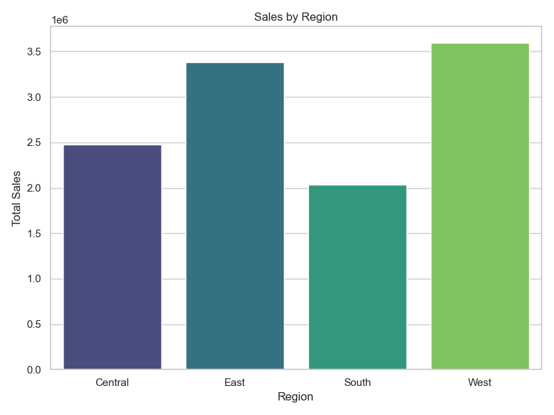

# 🛒 Exploratory Data Analysis of Sales Data

## 📌 Project Overview
This project performs an **exploratory data analysis (EDA)** on a retail store sales dataset.  
The main goal is to uncover key business insights such as **best-selling products, regional performance, and seasonal trends**.

## 🛠️ Tools & Libraries
- Python (Pandas, NumPy)
- Data Visualization (Matplotlib, Seaborn)
- Jupyter Notebook

## 📂 Dataset
- Source: [Superstore Sales Dataset - Kaggle](https://www.kaggle.com/datasets/vivek468/superstore-dataset-final)
- Key Features: `Order Date`, `Product Name`, `Category`, `Region`, `Sales`, `Quantity`, `Total Sales`

## 🚀 Analysis Steps
1. Data Cleaning and Preprocessing
2. Exploratory Data Analysis
3. Data Visualization
4. Business Insights

## 📊 Visualizations

## 💡 Key Insights
- The **top 3 products** account for 25% of total revenue.
- The **West region** leads in sales, while the **South region** shows growth potential.
- There is a **strong sales peak in December**, indicating opportunities for promotional campaigns.

## 🔗 Useful Links
- [Complete Notebook](notebooks/EDA_Superstore_Sales.ipynb)
- [Dataset on Kaggle](https://www.kaggle.com/datasets/vivek468/superstore-dataset-final)

---
✅ This project demonstrates my ability to **clean, analyze, and visualize business data**, helping companies make **data-driven decisions**.
